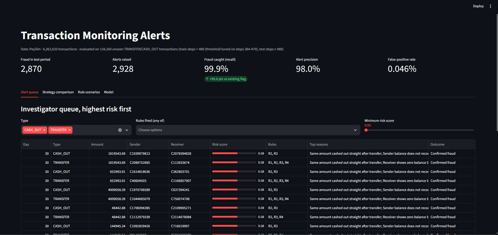

# Transaction Monitoring & Fraud Detection

[](https://github.com/thrijwal-k/aml-transaction-monitoring/actions/workflows/ci.yml)

A transaction monitoring system for mobile money payments. It combines the two approaches banks use to find financial crime:

1. **Rule-based scenarios**: the transparent first line of detection that compliance teams can explain to a regulator.
2. **Machine learning (XGBoost)**: learns patterns the rules miss and ranks alerts by risk.

Every alert comes with plain-English **reasons**, so an investigator can see *why* a transaction was flagged, plus a **Streamlit dashboard** with the investigator queue, scenario performance and model diagnostics.

## Why this matters

Transaction monitoring teams face two problems at once: missed fraud, and too many false positives for investigators to review. This project measures both. It compares the existing flag, rules on their own, machine learning on its own, and a hybrid, using recall, precision, false-positive rate and alert volume.

## Data

[PaySim](https://www.kaggle.com/datasets/ealaxi/paysim1) (Lopez-Rojas et al., 2016) is a synthetic dataset of 6.36 million mobile money transactions over 30 days, simulated from real transaction logs. It has 8,213 fraud cases (0.13%) in which fraudsters take over accounts, empty them with a **transfer** to a mule account, and **cash out**.

Download it free from Kaggle (you need a Kaggle account) and save the CSV as `data/paysim.csv`.

## Approach

| Step | What it does |
|---|---|
| **Scope** | Monitors TRANSFER and CASH_OUT, the only types where fraud occurs (2.77m transactions) |
| **Features** | Amount, amount relative to balance, account emptied, balance reconciliation checks, rapid pass-through (the same amount transferred and cashed out within an hour), receiver fan-in and daily activity |
| **Rules (R1–R5)** | Large transfer over 200,000 · account emptied · rapid pass-through · receiver balance mismatch · receiver gets money from 3+ senders in a day |
| **Model** | XGBoost with class weighting for 0.13% fraud. **Time-based split**: trained on days 1–20, tested on days 21–31, so the test never uses future data. The threshold is tuned on the last 4 training days to maximise F2 (recall counts double, because a missed fraud costs more than an extra review). |
| **Comparison** | Isolation Forest, an unsupervised model trained without labels, shows what is possible when no fraud labels exist |
| **Hybrid alerting** | Alert if the model score passes the threshold **or** 3+ rules fire |
| **Explainability** | Each alert's top 3 reasons come from XGBoost's built-in SHAP contributions |
| **Stress test** | PaySim fraud is unusually easy to separate: balance fields are inconsistent only for fraud, fraud transfers and cash-outs come in exactly matched pairs, and the final days are fraud-heavy. The model is retrained with each group of artefacts removed, and precision is re-weighted to the monthly fraud rate, to show what holds up |

## Results



Trained on days 1–20 and evaluated on **134,160 unseen transfers and cash-outs (2,870 fraud cases) from days 21–31**.

| Strategy | Alerts | Fraud caught | Recall | Precision | False-positive rate |
|---|---|---|---|---|---|
| Existing PaySim flag | 10 | 10 | 0.3% | 100.0% | 0.000% |
| Rules: 2+ scenarios | 12,395 | 2,860 | 99.7% | 23.1% | 7.263% |
| Rules: 3+ scenarios | 1,487 | 1,427 | 49.7% | 96.0% | 0.046% |
| XGBoost | 2,868 | 2,868 | 99.9% | 100.0% | 0.000% |
| **Hybrid: XGBoost or 3+ rules** | **2,928** | **2,868** | **99.9%** | **98.0%** | **0.046%** |

**Headline:** the hybrid catches 99.9% of fraud with **76% fewer alerts** than rule-based monitoring (2,928 vs 12,395). The existing flag catches 0.3%.

### Stress test: is the headline real?

A near-perfect score on fraud data is a warning sign, so I retrained the model with each group of simulator artefacts removed. The test days are also fraud-heavy (2.14% of transactions, compared with 0.30% across the month), so the last column re-weights precision to the monthly fraud rate.

| Features used | PR-AUC | Recall | Precision | Precision at monthly fraud rate |
|---|---|---|---|---|
| All features | 1.000 | 99.9% | 100.0% | 100.0% |
| Without balance fields | 0.998 | 99.4% | 99.9% | 99.0% |
| Without balance fields or pass-through pairing | 0.407 | 42.6% | 48.1% | 11.2% |
| Behaviour only (amount, type, receiver activity) | 0.319 | 24.9% | 58.6% | 16.2% |

**What this shows:**
- The balance fields matter less than expected. Removing them barely changes performance.
- The real driver is **pass-through pairing**. In PaySim, every fraud transfer is followed by a cash-out of exactly the same amount, which is far more regular than real money laundering. Without it, PR-AUC falls from 1.000 to 0.407.
- On **behaviour alone**, the model still flags fraud at **16% precision at the real 0.3% fraud rate, about 54 times better than random**. That is the honest figure to expect on data that doesn't have PaySim's patterns.

Isolation Forest, with no labels at all, reached a PR-AUC of 0.990. That is further evidence that PaySim fraud is unusually easy to separate.

Reproduce: run the pipeline, then `python report.py`, which writes `RESULTS.md`.

## Run it

```bash
pip install -r requirements.txt
python run_pipeline.py --data data/paysim.csv   # about 1-3 minutes and 3-4 GB RAM on a laptop
python report.py                                # writes RESULTS.md and prints the headline figures
streamlit run app.py                            # opens the dashboard in your browser
```

No data yet? `python run_pipeline.py --synthetic` runs everything on generated test data. Those numbers are for testing only.

Tests: `python -m pytest -q`

## CI/CD and Docker

Every push to `main` runs a GitHub Actions pipeline (`.github/workflows/ci.yml`) with four stages:

1. **Test**: lint with Ruff, run the unit tests, then run the whole pipeline end to end on synthetic data and check that it produces its outputs.
2. **Docker**: build the image, run the pipeline inside the container, then start the dashboard and wait for its health check to pass.
3. **Kubernetes**: create a local cluster with kind, deploy the manifests in `k8s/`, wait for the rollout, then check the dashboard's health through the Kubernetes Service.
4. **Publish**: if every earlier stage passes, push the image to GitHub Container Registry, tagged `latest` and with the commit hash.

Run it in Docker:

```bash
docker build -t aml-monitoring .
# run the pipeline (mount your data and an outputs folder)
docker run --rm -v "$PWD/data:/app/data" -v "$PWD/outputs:/app/outputs" aml-monitoring python run_pipeline.py --data data/paysim.csv
# open the dashboard at http://localhost:8501
docker run --rm -p 8501:8501 -v "$PWD/outputs:/app/outputs" aml-monitoring
```

The image runs as a non-root user and includes a health check on Streamlit's `/_stcore/health` endpoint.

### Kubernetes

`k8s/deployment.yaml` runs the pipeline once in an **init container**, which writes its results to a shared volume, then starts the dashboard from those results. The pod runs as a non-root user, and has readiness and liveness probes on the health endpoint plus CPU and memory requests and limits. `k8s/service.yaml` exposes the dashboard inside the cluster.

```bash
kind create cluster --name aml
docker build -t aml-monitoring:ci .
kind load docker-image aml-monitoring:ci --name aml
kubectl apply -f k8s/
kubectl rollout status deployment/aml-dashboard
kubectl port-forward service/aml-dashboard 8080:80   # open http://localhost:8080
```

## Project structure

```
run_pipeline.py      end-to-end pipeline: features, rules, models, evaluation, alerts
report.py            turns the metrics into RESULTS.md
app.py               Streamlit alerts dashboard
src/data.py          PaySim loader and synthetic test-data generator
src/features.py      transaction features and plain-English reason labels
src/rules.py         monitoring scenarios R1-R5 and per-rule performance
tests/               unit tests for rules and features
docs/dashboard.png   dashboard screenshot
Dockerfile           container image for the pipeline and dashboard
.github/workflows/   CI/CD pipeline: lint, test, Docker, Kubernetes deploy, publish
k8s/                 Kubernetes Deployment and Service
ruff.toml            lint rules
```

## Limitations and next steps

- PaySim is simulated. Real transaction monitoring adds customer due diligence (KYC) data, sanctions screening and account history.
- The receiver fan-in rule works best on network-style data. A graph approach (for example, linking accounts that share mules) would extend it.
- Rule thresholds are fixed. In practice, they would be tuned by "above and below the line" testing with investigators.
